Title: Pyslvs-user-manual-1
Date: 2017-02-22 11:00
Category: Course
Tags: brython, w1
Slug: 2017springCD-Week1
Author: 40423248

####簡介及介面介紹:

###Pyslvs基本是由Python和slovespace所開發出來的運動模擬軟體
###可以在此軟體中用點和直線的連結來做基本的連桿運動分析及位置紀錄
###此版本為0.9dev,目前處於開發中的階段,有部分功能尚未開放,現在做的是基本測試

###以下為0.9dev版本的介面說明:

<!-- PELICAN_END_SUMMARY -->

###這裡是一開始的介面
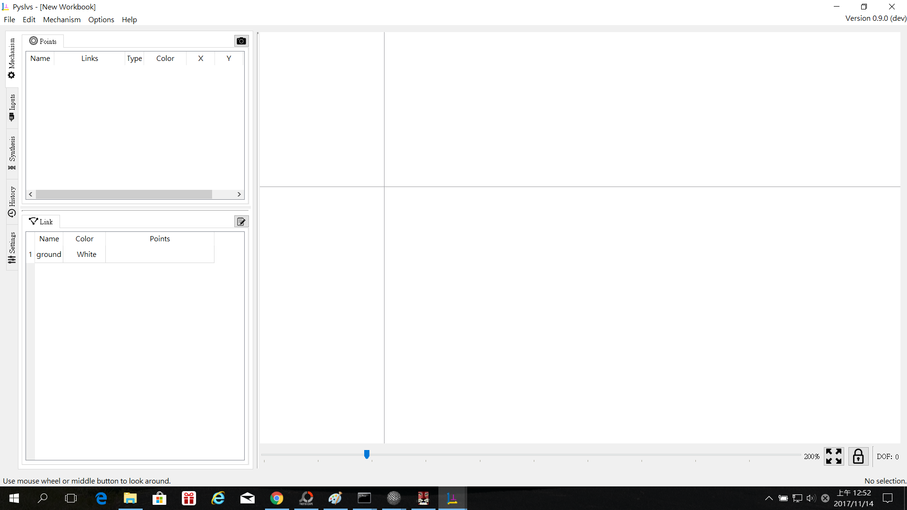

###左上角的功能有(藍色方框處由左看來):
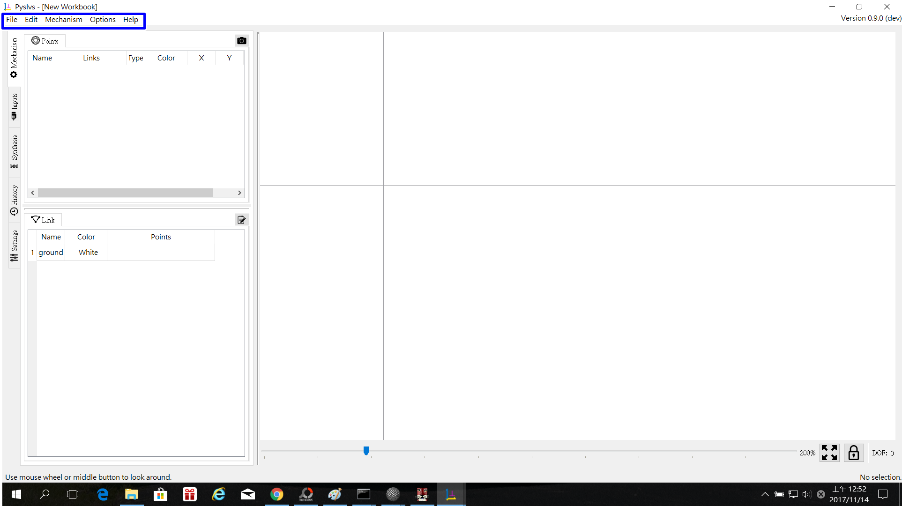
####1.檔案 2.編輯 3.機構 4.選項 5.幫助

###檔案中的內容:
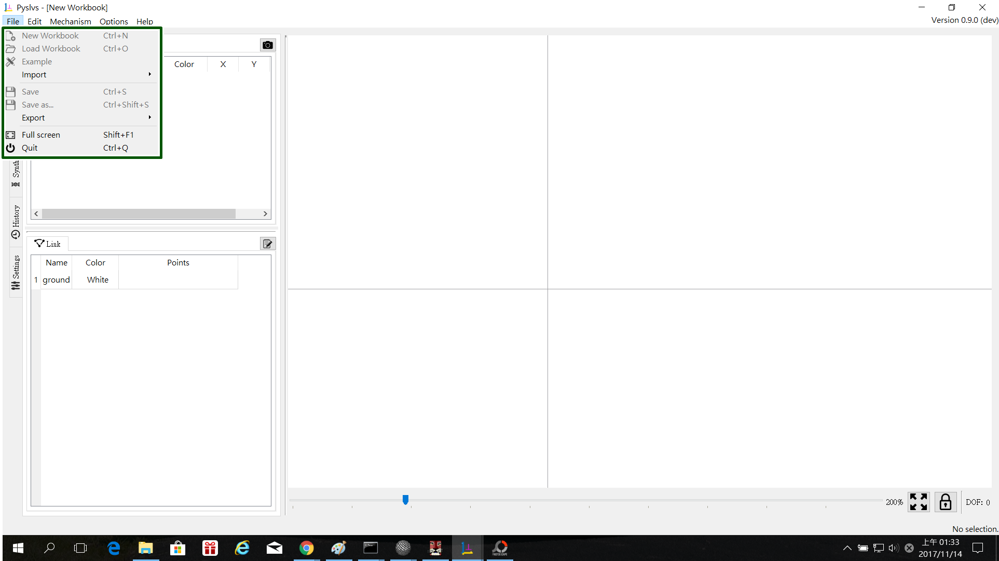
####1.開啟新的工作簿(尚未開放) 
####2.讀取工作簿(尚未開放) 
####3.開啟範例(尚未開放)
####4.導入(PMKS) 
####5.儲存為(尚未開放)
####6.另存為(尚未開放) 
####7.導入 
####8.全螢幕 
####9.離開

###編輯中的內容:
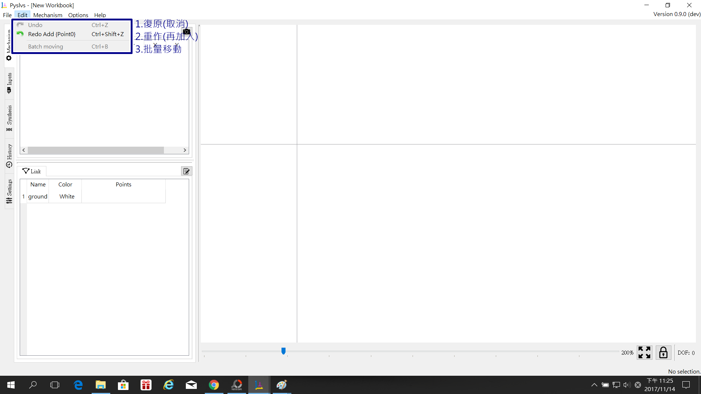
####1.復原(取消)
####2.重作(再加入)
####3.批量移動(尚未開放)

###機構中的內容:
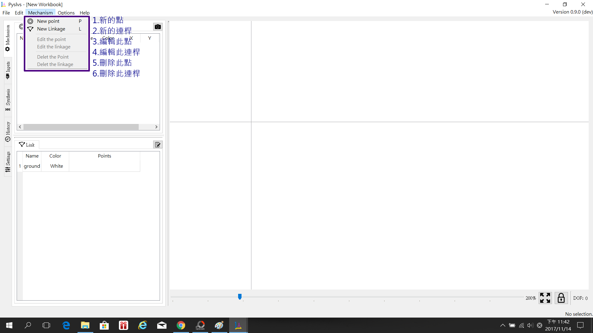
####1.新的點(建立一個點,ALT+P) 
####2.新的連桿(建立一根連桿,ALT+L) 
####3.編輯此點(點的細節)
####4.編輯此連桿(連桿的細節)
#### 5.刪除此點 
####6.刪除此連桿

###選項中的內容:
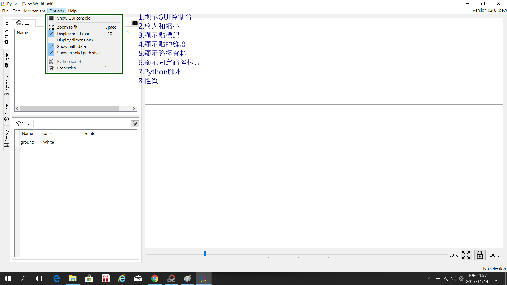
####1.顯示GUI控制台 
####2.放大和縮小 
####3.顯示點標記
####4.顯示點的維度(X.Y座標) 
####5.顯示路徑資料 
####6.顯示固定路徑樣式
####7.Python腳本 
####8.性質

###幫助中的內容:
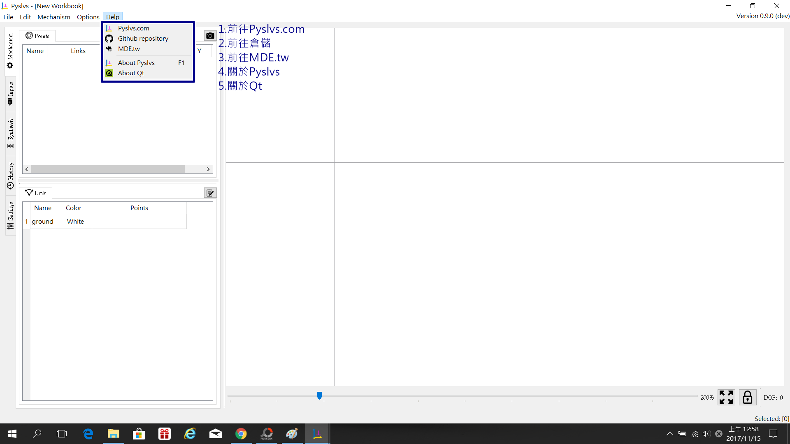
####1.前往Pyslvs.com 
####2.前往倉儲 
####3.前往MDE.tw 
####4.關於Pyslvs 
####5.關於Qt

###左側邊的部分(藍框部分-1):
###機構(包含點和連桿):
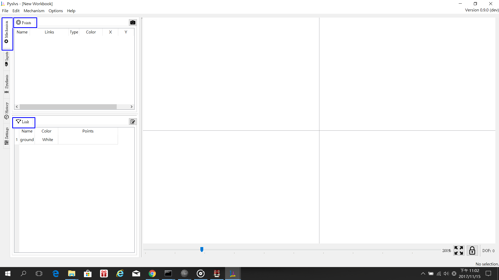

###這邊可以看到點的細節,還有連桿的細節,以及點和連桿之間配合的關係
###如下圖所示:
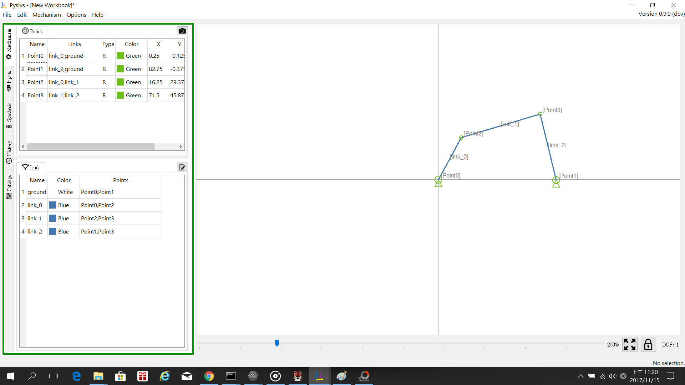

###相機(綠框)與筆記本(藍框)
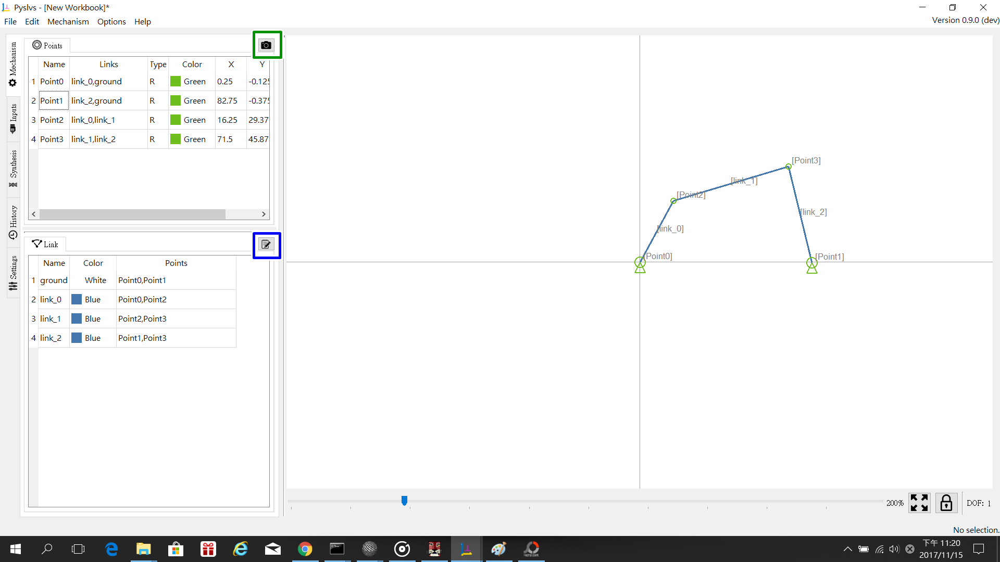
####相機(綠框):繪製好一個機構時,點一下相機圖案可以直接複製截圖,可以貼到其他地方作保留
####如下圖所示:
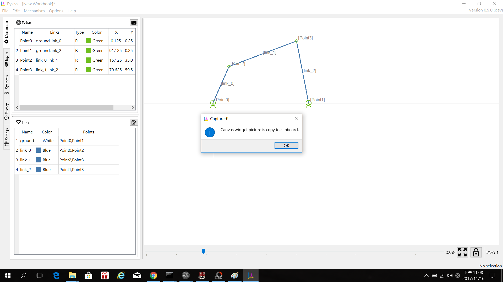
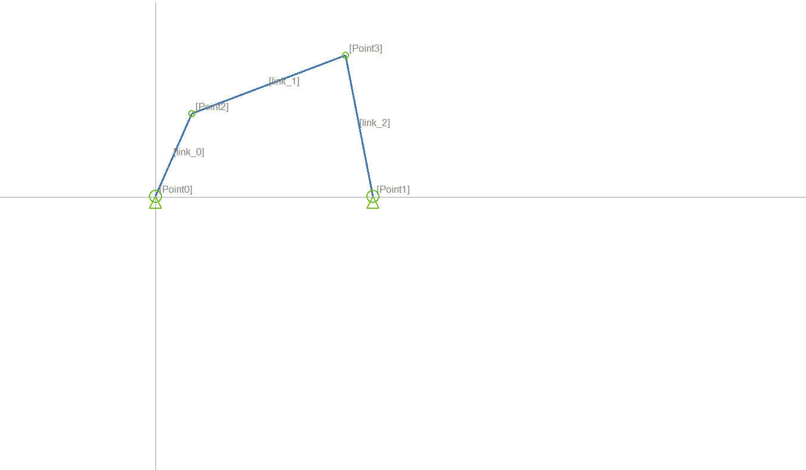

####筆記本(藍框):可以在此輸入此機構的作者名字及對於此機構的描述
####如下圖所示:
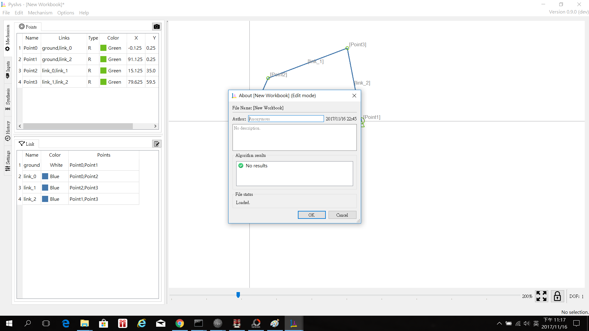

###左側邊的部分(藍框部分-2):
####輸入(點和連桿的配合):在這裡決定固定桿和驅動桿,並且做導入變數做運動模擬,
####還有記錄運動軌跡的功能
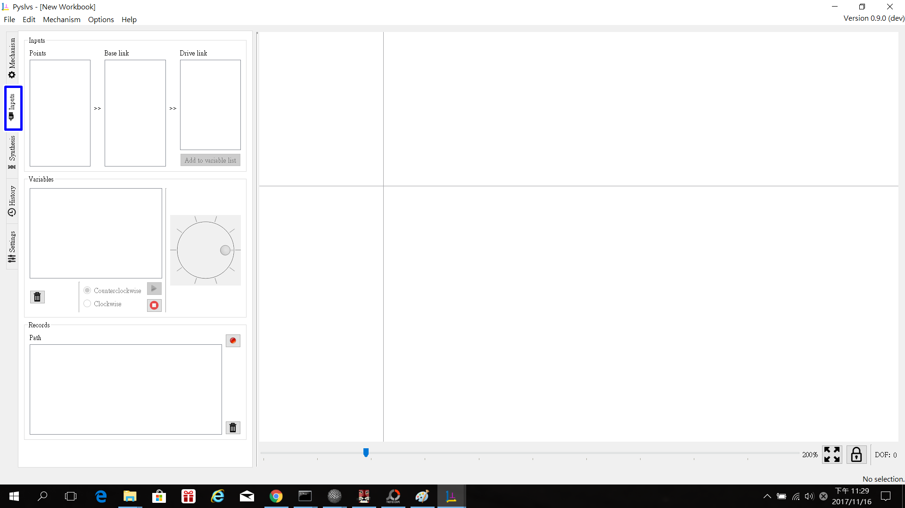

###條件順序:
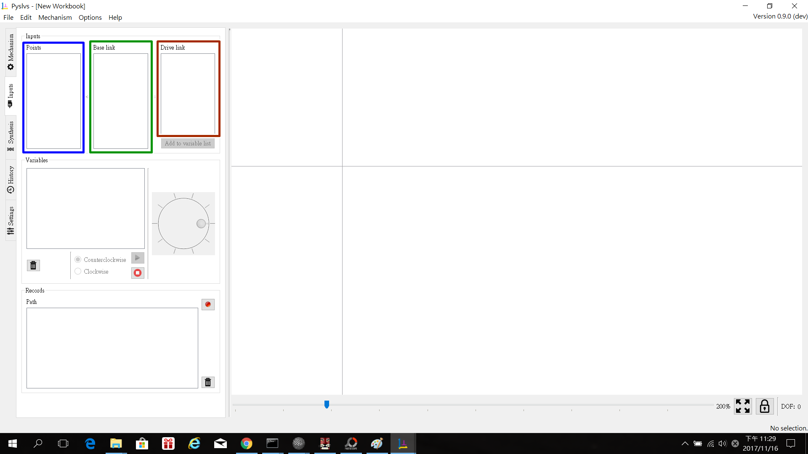
###藍色框:所有的點(活動及固定的)
###綠色框:決定固定桿
###棕色桿:決定驅動桿

###變數(紫色框):上面的條件順序決定好後導入這裡,可以做順時針或逆時針的旋轉(自動或手動),
###也可以捨棄此變數條件(垃圾桶圖示)
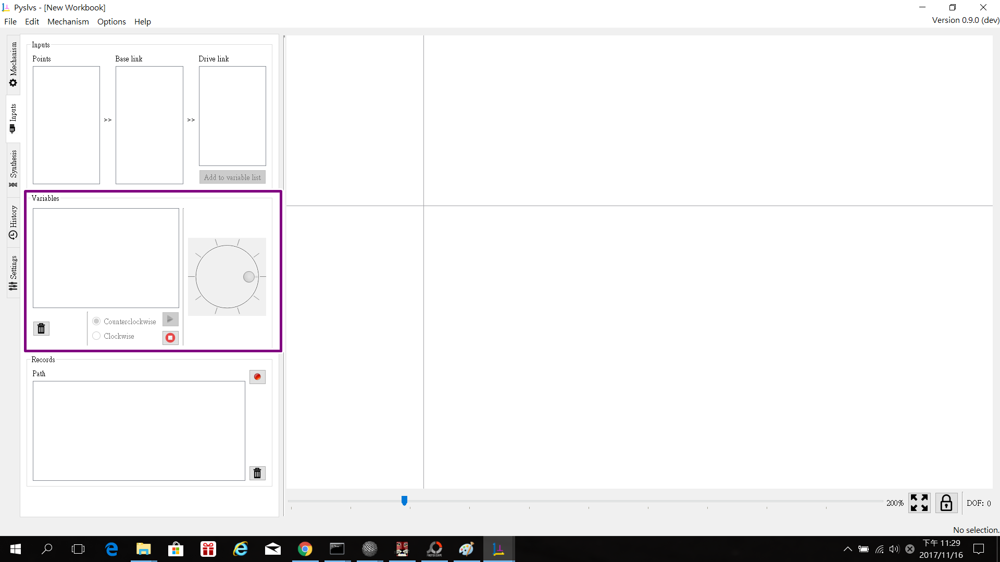

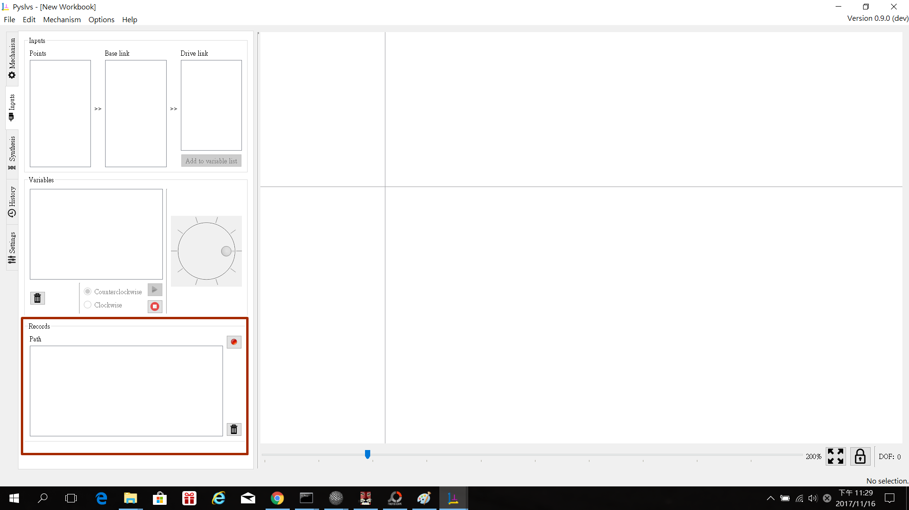

