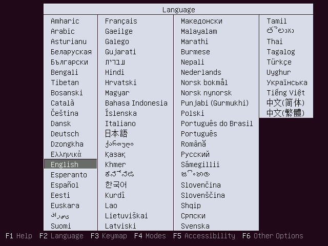
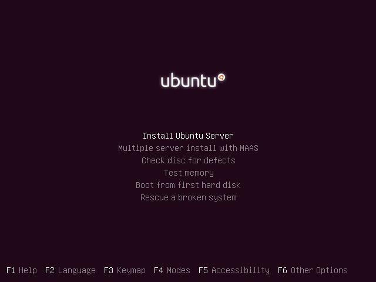
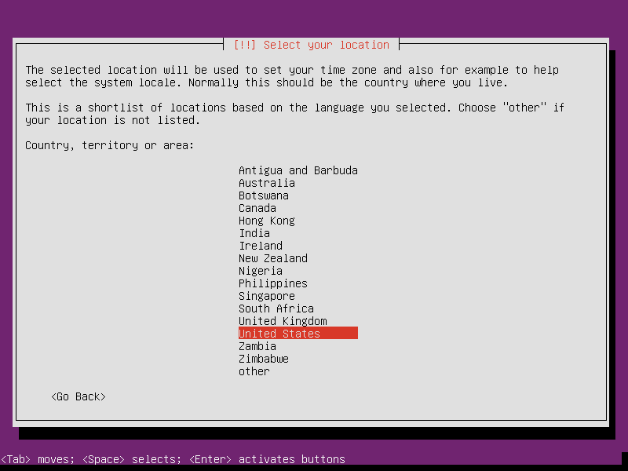
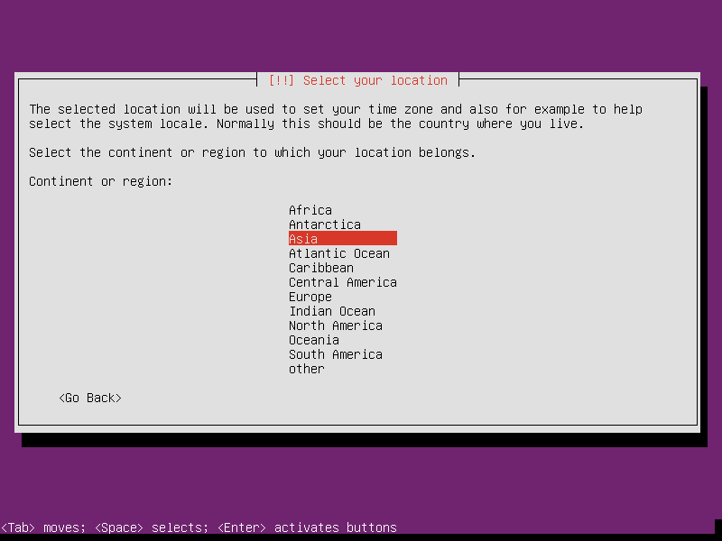
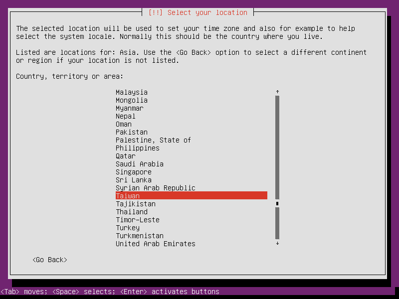
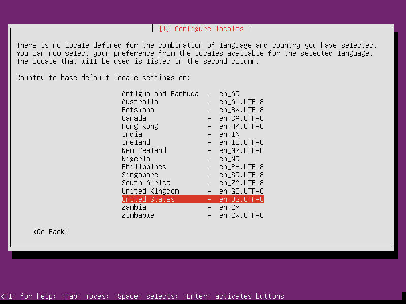
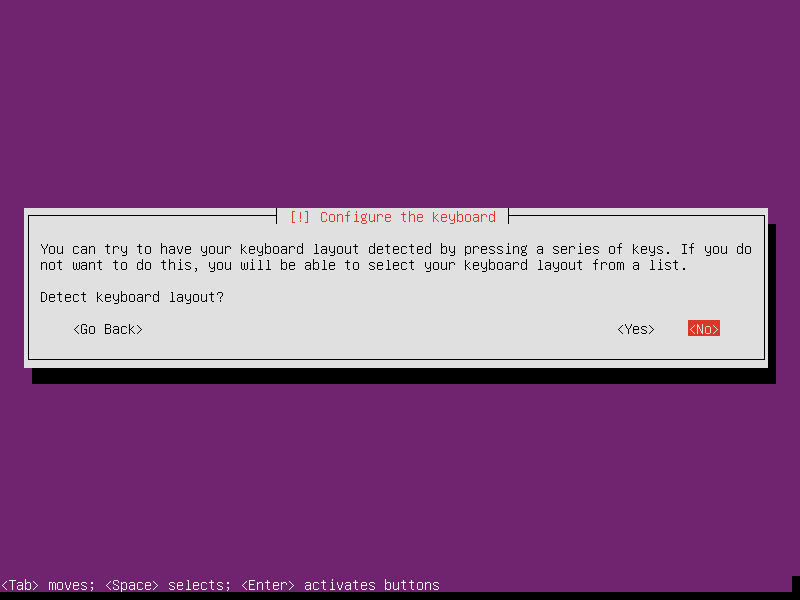
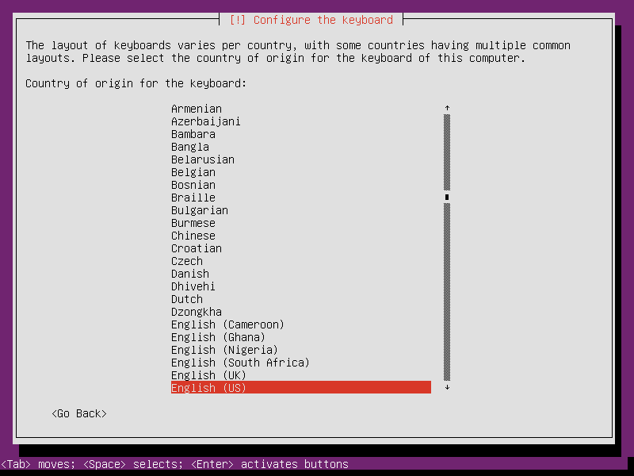
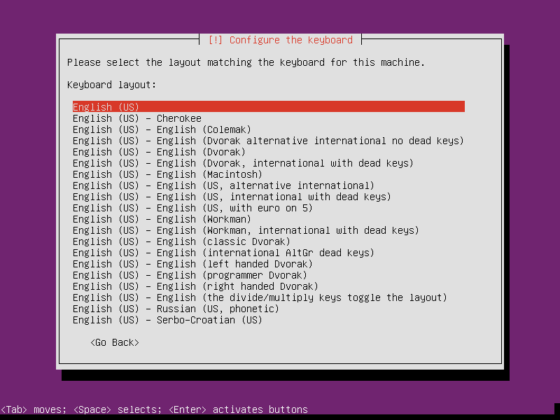

Title: 2017CD第十四週
Date: 2017-03-07 11:00
Category: Course
Tags: brython, w14
Slug: 2017springCD-Week14
Author: 40423248

第十四週上課內容

架設ubuntu伺服器

<!-- PELICAN_END_SUMMARY -->

Ubuntu簡介:
Ubuntu是基於Debian的Linux發行版。Debian的版本更新時間不固定，但Ubuntu會固定在每年的4月和10月釋出新版(每半年一新版)，版本號碼就是「年份.月份」，例如在2014年4月發佈的版本，號碼就是14.04；在2009年10月發佈的版本，號碼就是9.10。通常每隔兩年會釋出一個更新支援期長達2年以上的LTS(Long Term Support)版本，例如10.04、12.04、14.04、16.04就是LTS版，LTS版本因為支援期長，有很多時間修復BUG，因此愈後期的LTS版，執行起來會更穩定，如果有架設伺服器的需求，安裝LTS版本會是較好的選擇，尤其又以安裝專門用來架設伺服器的Ubuntu Server最好。

Ubuntu Server 14.04支援到西元2019年4月，可說是目前最穩定的Ubuntu伺服器版本。

安裝程式Ubuntu Server 14.04:http://www.ubuntu-tw.org/ (正體中文)

安裝光碟或USB:
從Ubuntu正體中文站下載下來的安裝程式為iso映像檔，如果要在電腦開機的時候進入Ubuntu Server，需要將iso映像檔燒錄成可開機的光碟，或是將iso映像檔用UNetbootin等軟體裝入USB儲存裝置中，製作成可開機的USB裝置。

安裝程序:
首先放入Ubuntu Server的開機光碟或是USB裝置，接著將電腦重新開機，進入BIOS的開機順序設定，將第一順位的開機裝置改為Ubuntu Server的所在裝置，儲存設定後重新開機。接著應該會看到類似以下的畫面，需要先選擇想使用的語言，建議使用國際語言─英文(English)。

然後會出現如下的選單。選擇「Install Ubuntu Server」即可開啟Ubuntu Server的安裝程式。

進入Ubuntu Server的安裝程式後，還要再選擇一次語言，建議選擇英文(English)。

接著選擇使用伺服器的位置，如果位置在台灣(Taiwan)，就選擇「亞洲(Asia)->台灣(Taiwan)」。

接著要設定系統會使用到的語系，建議值為「United States - en_US.UTF-8」。

再來要設定鍵盤排列方式，沒有特殊需求的話，使用手動設定，並選擇「English(US)」就好。

等待一段時間讓安裝程式自行處理一下。

