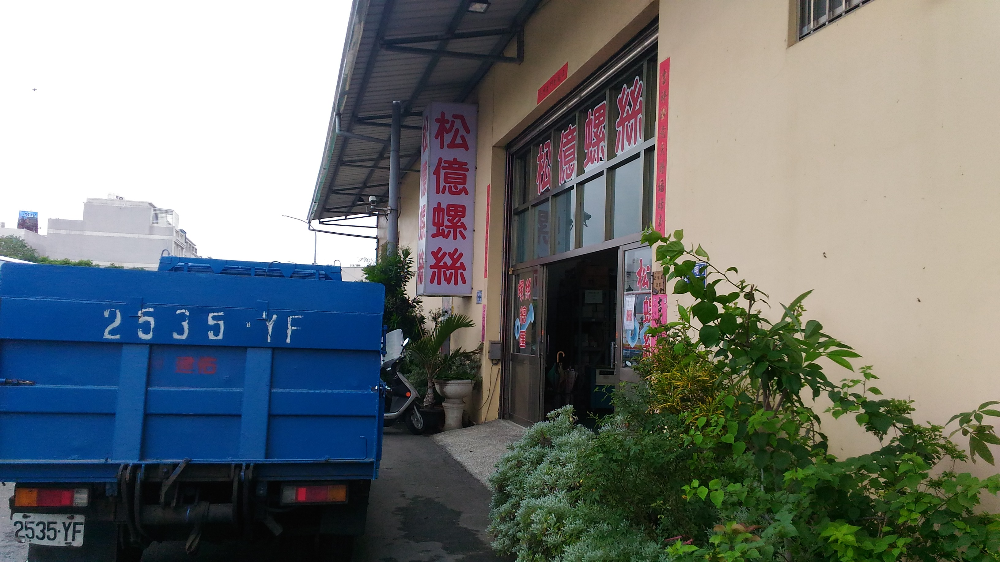

Title: 2017CD第十五週-2
Date: 2017-03-09 11:00
Category: Course
Tags: brython, w15-2
Slug: 2017springCD-Week15-2
Author: 40423248

#第十五週上課內容-2

<!-- PELICAN_END_SUMMARY -->

準備仿生獸活動軸所需的材料,前往松億螺絲尋找適合的材料,在裡面找一找發現
原來的設計需要修改許多地方,因為店內有的螺栓和螺絲尺寸大多數都是整數的,
有小數點的都屬於特規,數量少,價格也貴,而我們原來的軸孔部分的尺寸都有小數
點,所以還要再另外花時間在修改成整數位的尺寸,才可以做配合

###松億螺絲:

###地址:632雲林縣虎尾鎮光明路66號

###營業時間:週一至周五 早上8:10至下午17:10

###電話:05-632-2204