Title: Pyslvs-user-manual-2
Date: 2017-02-23 11:00
Category: Course
Tags: brython, w2
Slug: 2017springCD-Week2
Author: 40423248

####使用說明:

###這邊來說明Pyslvs基本的使用方式,先從基本的曲柄搖桿四連桿機構開始:

###一開始可以先想好四連桿的長度,繪製時再做調整,
如:固定桿L1= 100 ,曲柄L2= 40, 連結桿L3= 70 , 搖桿L4= 80,

###1.現在先來放點的位置,不用放的很準確,放點的指令快捷鍵為ALT+P
###大約如下:
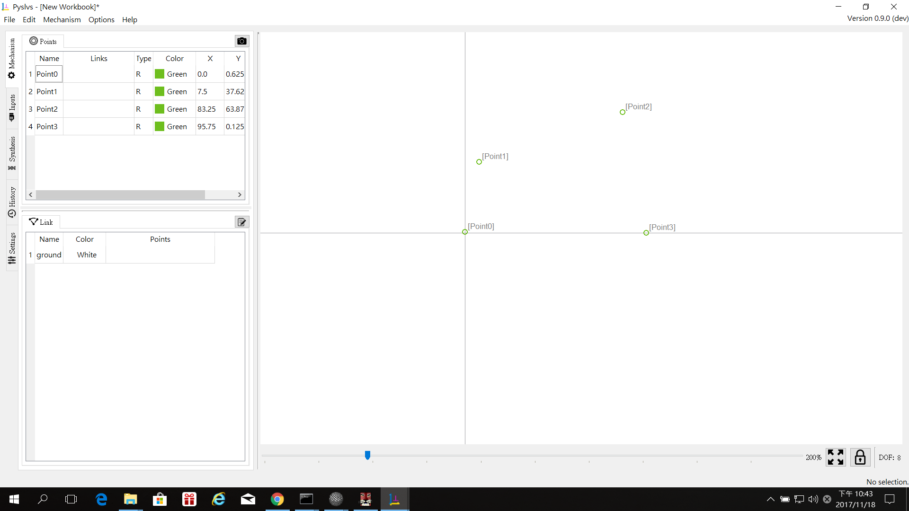

###再來是調整位置和定尺寸,要調整某個點時在該點上以左鍵點兩下
###如下圖:
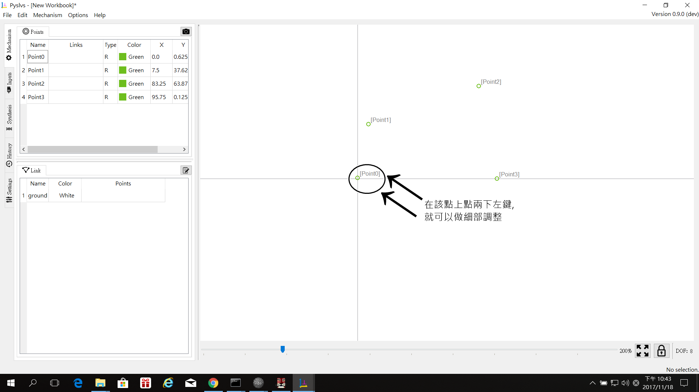

###點兩下會出現此視窗:
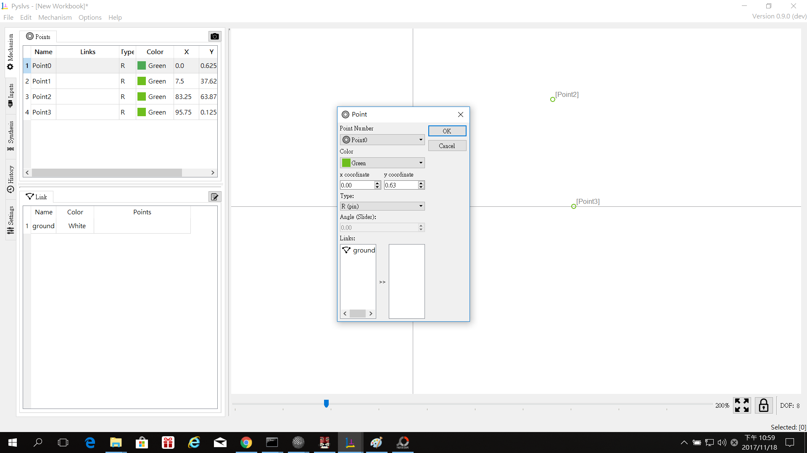

###裡面的選項:
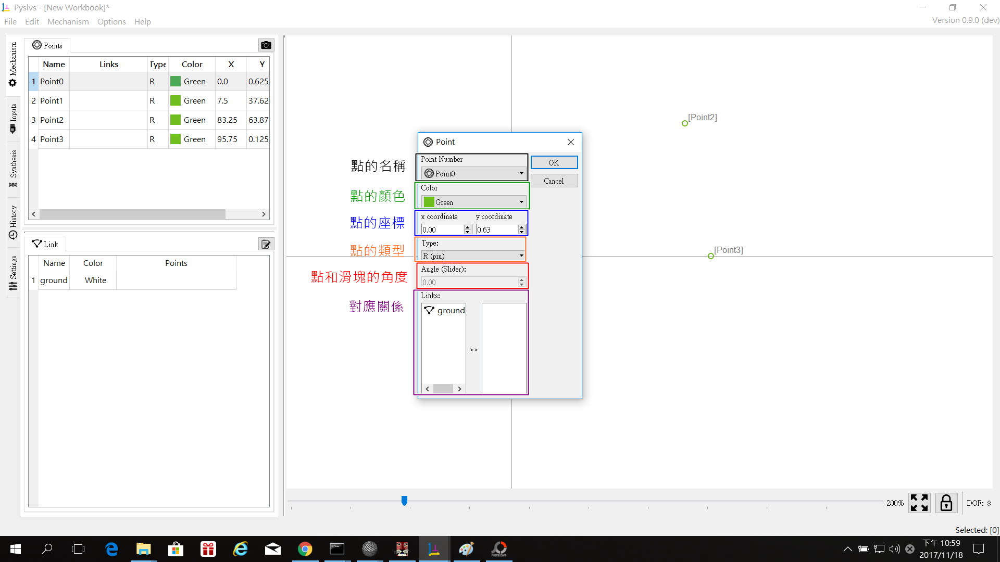
###點的名稱:現在所選的點

###點的顏色:可以更改顏色,做為區別
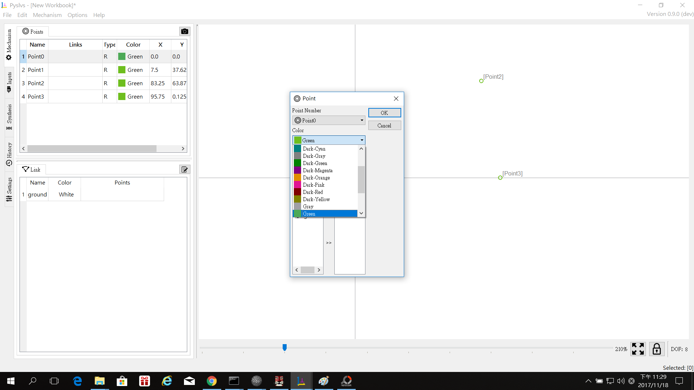

###點的座標:定位用,可在X軸和Y軸輸入任意值
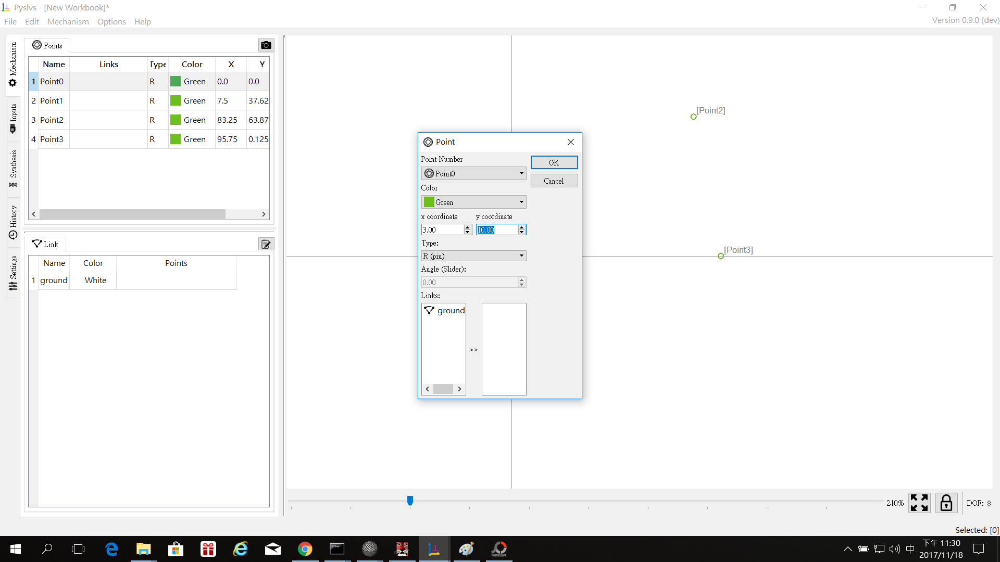

###點的類型:可以是銷,滑塊(尚未開放),滑槽(尚未開放)
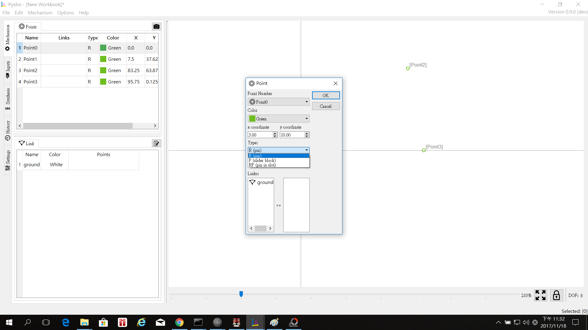

###點和滑塊的角度:(尚未開放)

###對應關係:
###調整連桿間的連結關係,可以把三,四個桿件合併成一個桿件

###2.做連桿:
###點選一個點,再點選另外一個點(要按著CTRL),接著再按下L,就會形成一根連桿
######如下圖:
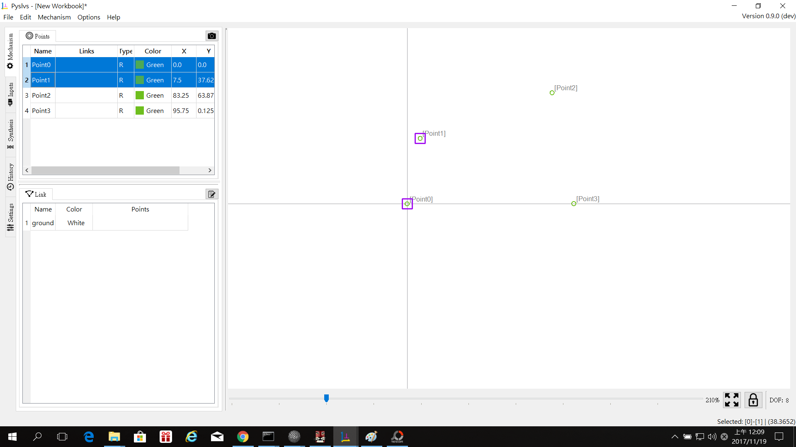
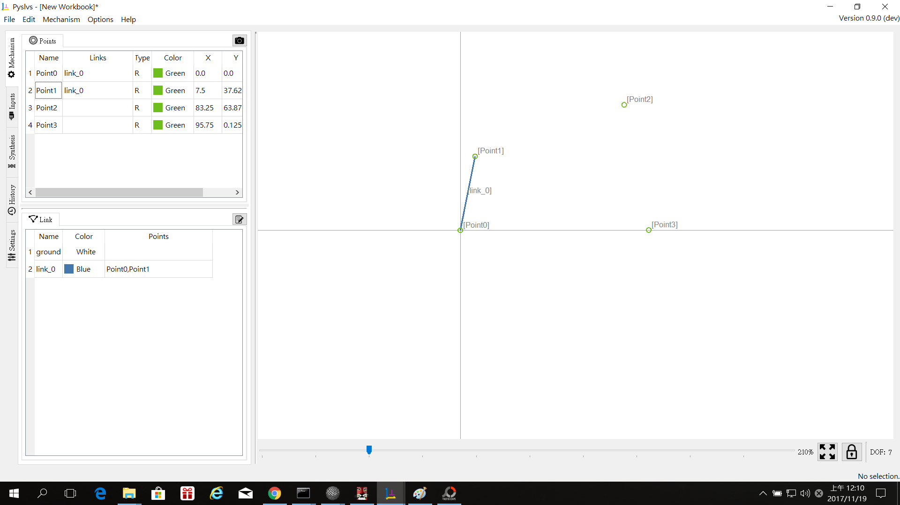

###接著把其他的連桿也都接起來,就如下圖:
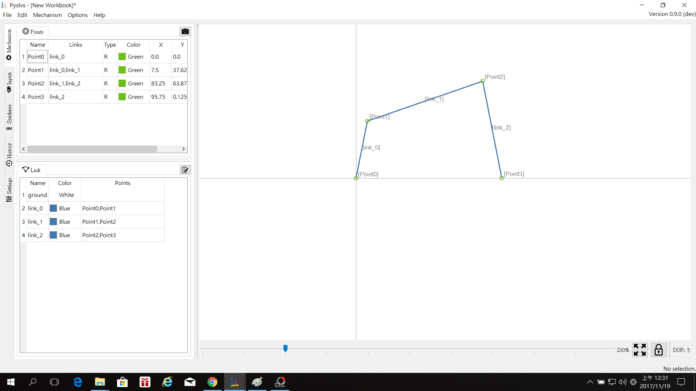

###再來是調整點的位置,調整完後,如下圖:
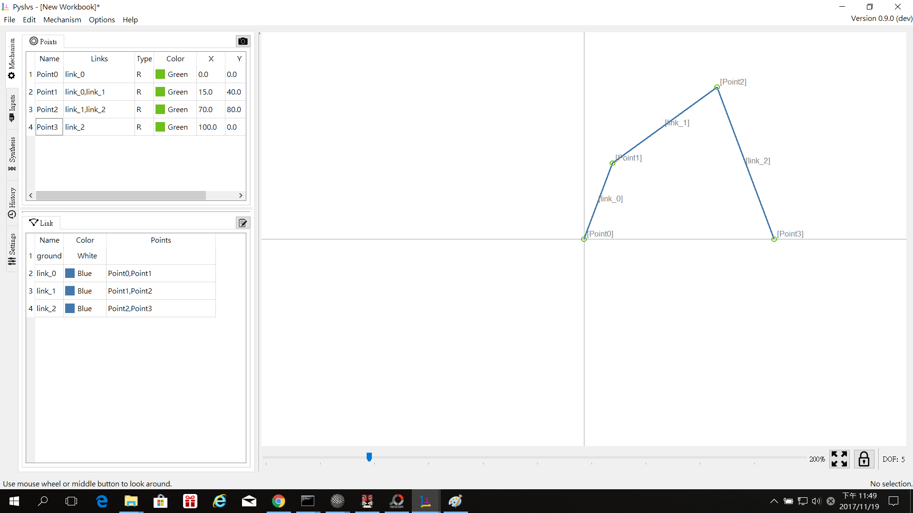

###這邊還要做固定點,要固定某一點時,在該點上點右鍵,點選Fixed
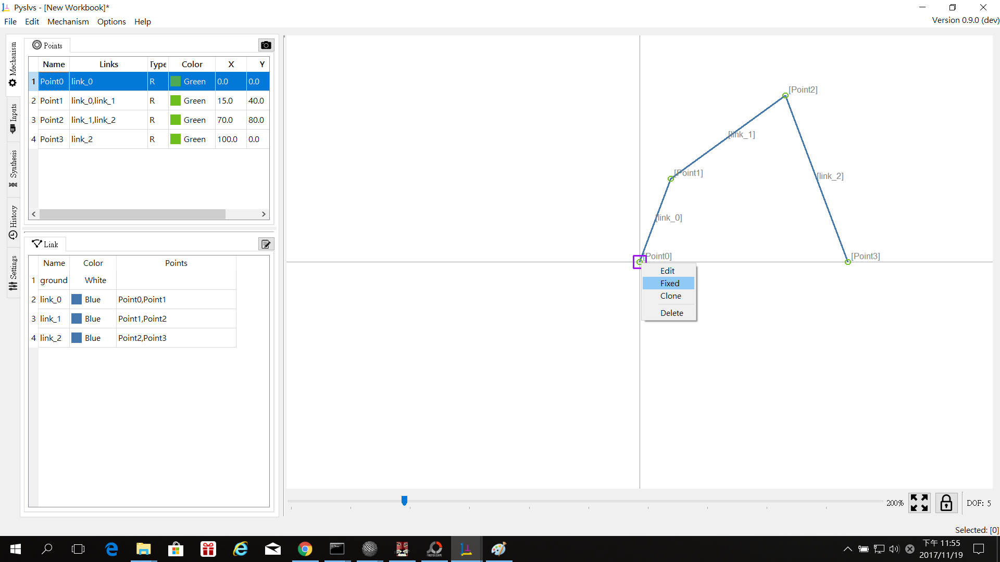

