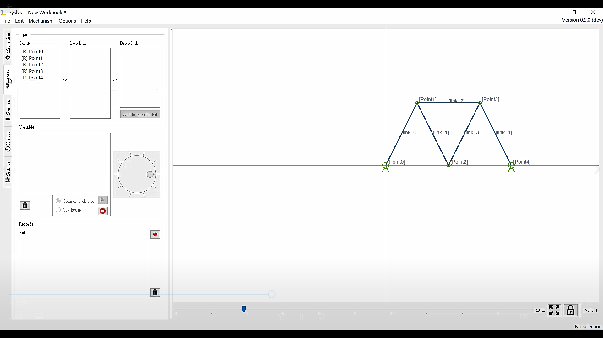
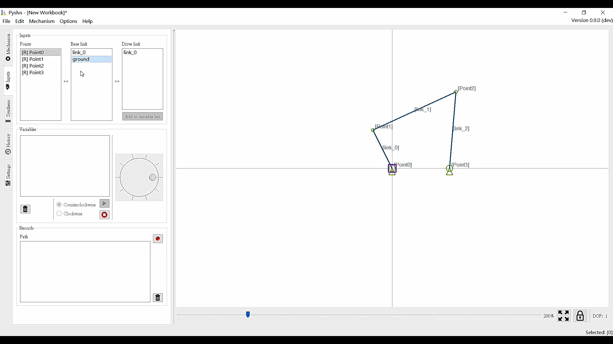
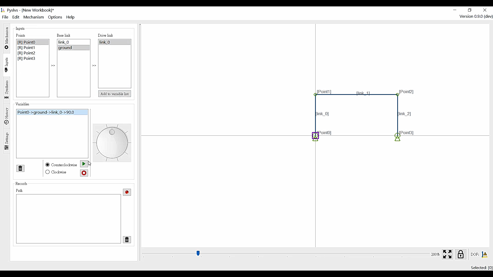

Title: 2017CD第三週
Date: 2017-02-24 11:00
Category: Course
Tags: brython, w3
Slug: 2017springCD-Week3
Author: 40423248

###其他試作範例:

###1.直線運動機構:
####羅伯特機構(Robert Mechaniam):

####當(point0+point1)=(point1+point2)=(point2+point3)=(point3+point4),以及(point0+point2)=(point1+point3)=(point2+point4)時,point2可以做出近似於直線運動的路徑,而增加長度的比值時,會有更準確的直線運動
<iframe src="https://player.vimeo.com/video/244522382" width="640" height="343" frameborder="0" webkitallowfullscreen mozallowfullscreen allowfullscreen></iframe>

<a href="https://vimeo.com/244522382">Pyslvs 0.9-beta.1 test Robert Mechaniam</a> from <a href="https://vimeo.com/user46447136">40423248</a> on <a href="https://vimeo.com">Vimeo</a>.

####牽桿機構(Drag-link Mechanism):

####此連桿的最短桿為固定桿(point0+point3),曲柄(point0+point2),(point3+point4)可以做整圈的旋轉
<iframe src="https://player.vimeo.com/video/244522368" width="640" height="343" frameborder="0" webkitallowfullscreen mozallowfullscreen allowfullscreen></iframe>

<a href="https://vimeo.com/244522368">Pyslvs 0.9-beta.1 test Drag-link Mechanism</a> from <a href="https://vimeo.com/user46447136">40423248</a> on <a href="https://vimeo.com">Vimeo</a>.

####

<iframe src="https://player.vimeo.com/video/244522379" width="640" height="343" frameborder="0" webkitallowfullscreen mozallowfullscreen allowfullscreen></iframe>

<a href="https://vimeo.com/244522379">Pyslvs 0.9-beta.1 test Parallel crank four-bar linkage</a> from <a href="https://vimeo.com/user46447136">40423248</a> on <a href="https://vimeo.com">Vimeo</a>.

###Double rocker mechanism

<iframe src="https://player.vimeo.com/video/244676638" width="640" height="343" frameborder="0" webkitallowfullscreen mozallowfullscreen allowfullscreen></iframe>

<a href="https://vimeo.com/244676638">Pyslvs 0.9-beta.1 test Double rocker mechanism</a> from <a href="https://vimeo.com/user46447136">40423248</a> on <a href="https://vimeo.com">Vimeo</a>.

