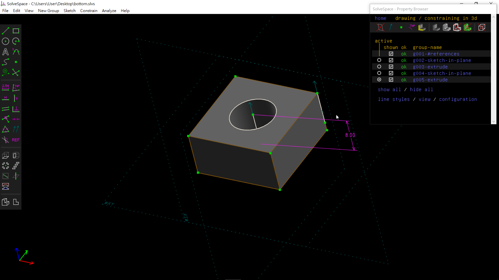
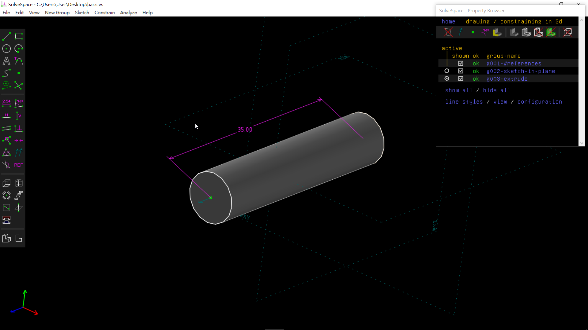
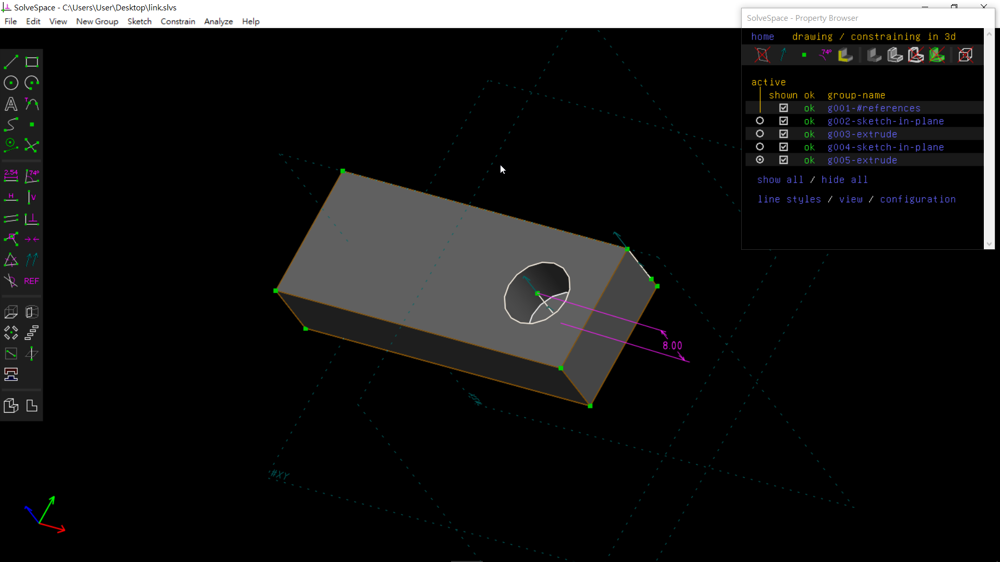

Title: 2017CD第五週
Date: 2017-02-26 11:00
Category: Course
Tags: brython, w5
Slug: 2017springCD-Week5
Author: 40423248

第五週上課內容

###1.如何在fossil筆記倉儲頁面顯示作業內容

###在WIKI裡新增一個與倉儲筆記同名稱的檔案，就會在FOSSIL筆記倉儲主頁顯示

###建立時WIKI有三種格式，WIKI、MARKDOWN及HTML，安全性的排序:WIKI>MARKDOWN>HTML

<!-- PELICAN_END_SUMMARY -->

###2.把單連桿轉為.STL檔，再導入V-rep做動態模擬

