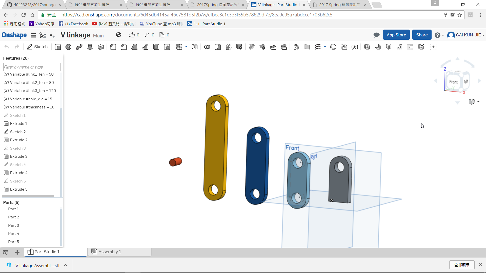
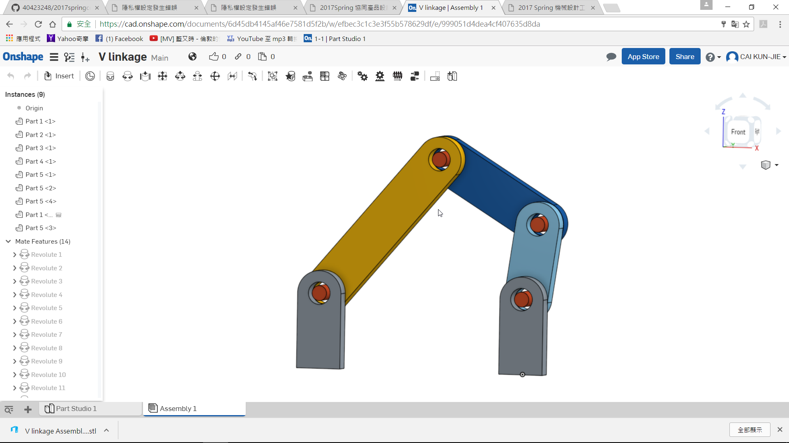
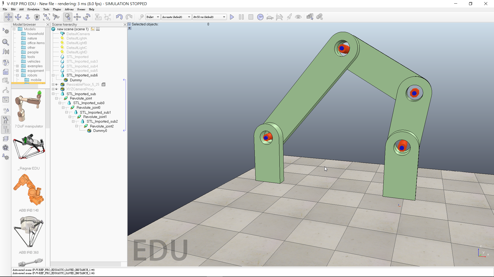

Title: 2017CD第六週
Date: 2017-02-27 11:00
Category: Course
Tags: brython, w6
Slug: 2017springCD-Week6
Author: 40423248

第六週上課內容
##1.用Onshape裡面的變數限制條件來繪製四連桿，並導入V-REP做動

<!-- PELICAN_END_SUMMARY -->

<iframe src="https://player.vimeo.com/video/214692737" width="640" height="359" frameborder="0" webkitallowfullscreen mozallowfullscreen allowfullscreen></iframe>

<a href="https://vimeo.com/214692737">2017CD 第六週</a> from <a href="https://vimeo.com/user46447136">40423248</a> on <a href="https://vimeo.com">Vimeo</a>.
