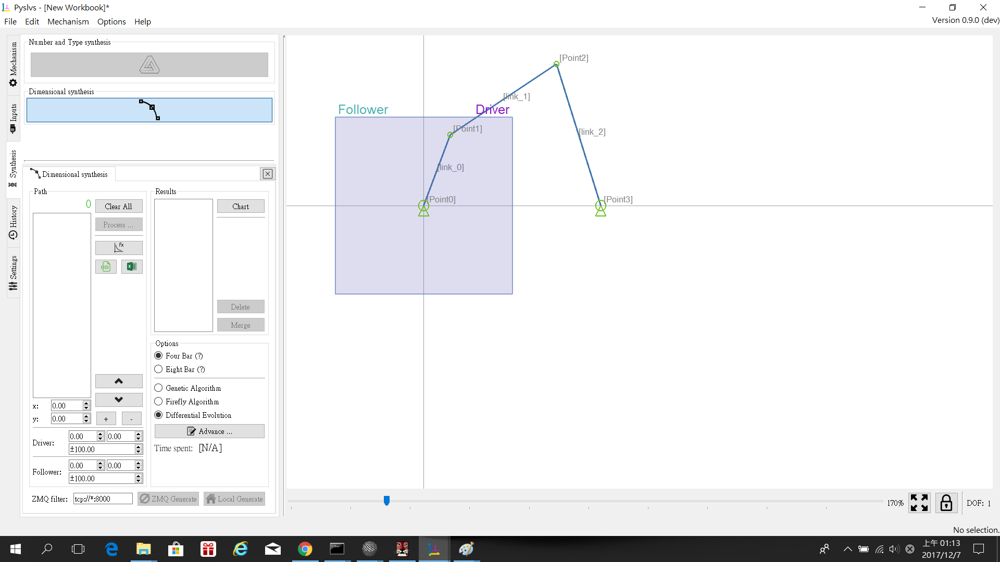
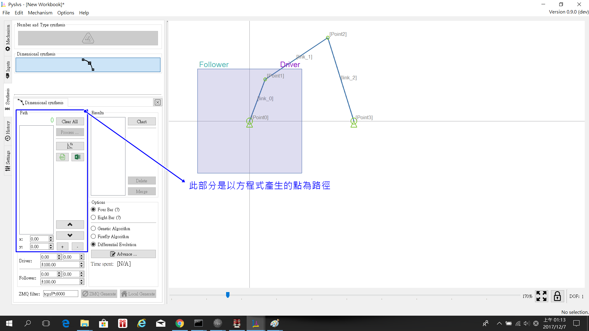
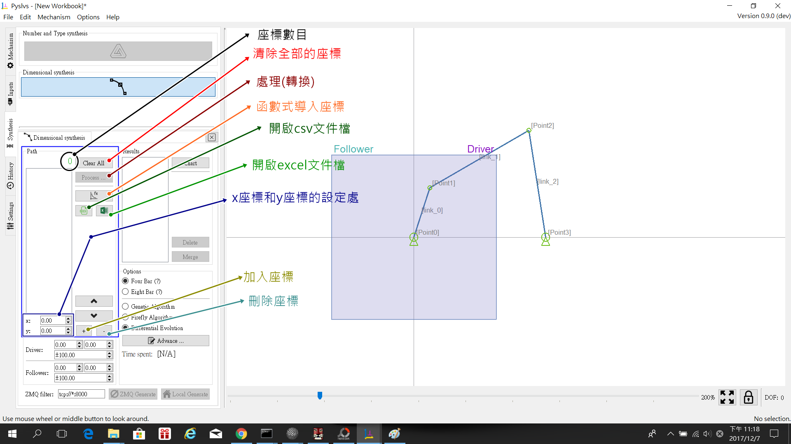
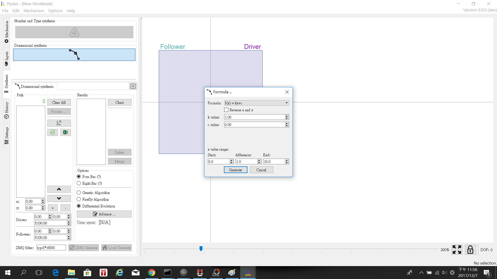
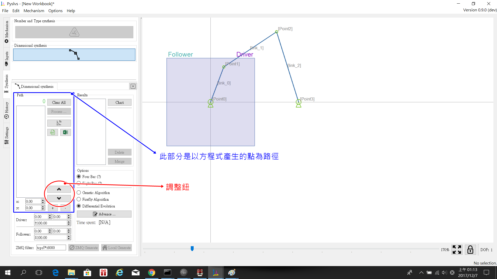

Title: 2017CD第七週
Date: 2017-02-28 11:00
Category: Course
Tags: brython, w7
Slug: 2017springCD-Week7
Author: 40423248

###補充0.9dev(Pyslvs 0.9-beta.1)左側邊的部分(藍框部分-3)的合成介面介紹:
####在前面的部份有到說一使用程式就會直接跳出,是因為按了Process(處理)這個按鈕,這個功能是還沒有完成的,所以還不能用,在這邊對可以用的功能來試用:

###藍色框中的內容(Path):

####1.座標數目:顯示白框內目前有的座標數量
####2.清除全部的座標:刪除白框內的所有座標
####3.處理(轉換):此功能暫時無法使用,按了程式會跳掉
####4.函數式導入座標:用此功能所提供的四個函數式來產生連續的座標路徑,可以任意設定變數值及範圍變化,介面如下圖:
####Formula:
####(1)f(x)=kx+c  
####(2)f(x)=kx^2+c
####(3)f(x)=k*cos(x*π/180)+c
####(4)f(x)=k*sin(x*π/180)+c

####5.開啟csv文件檔:從外部開啟csv檔來導入座標
####6.開啟excel文件檔:從外部開啟excel檔來導入座標
####7.x座標和y座標的設定處:這邊可以任意設定x和y的座標點
####8.加入座標:此按鈕可以把7.部分的座標加入到白框內
####9.刪除座標:此按鈕可以在白框內選取的座標給移除
###備註:

####圖中以紅圈圍起來的兩個按鈕似乎功能不穩,點擊按鈕會讓程式跳掉

###綠色框中的內容:
####在右邊可以看到

