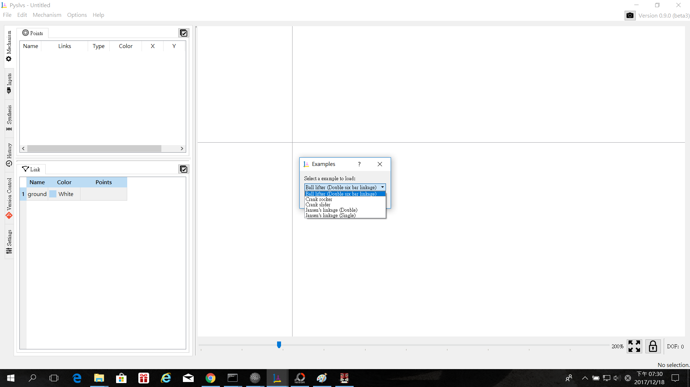
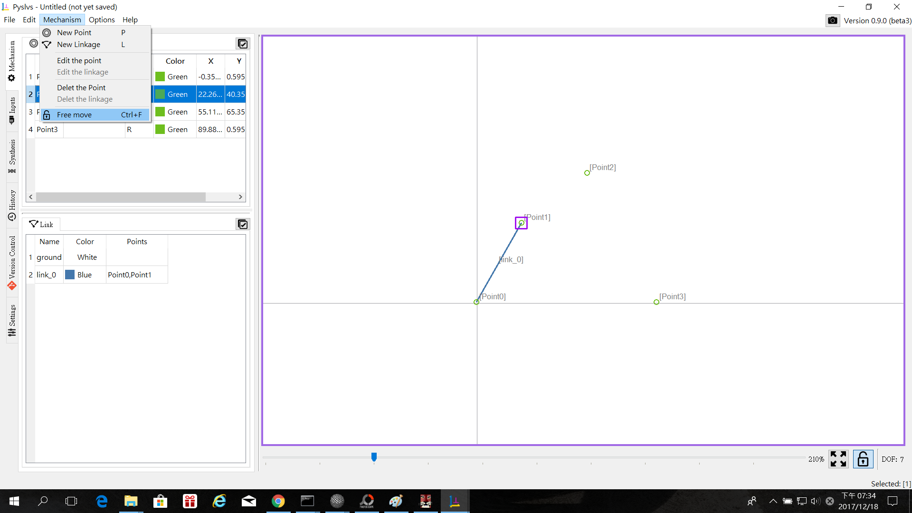
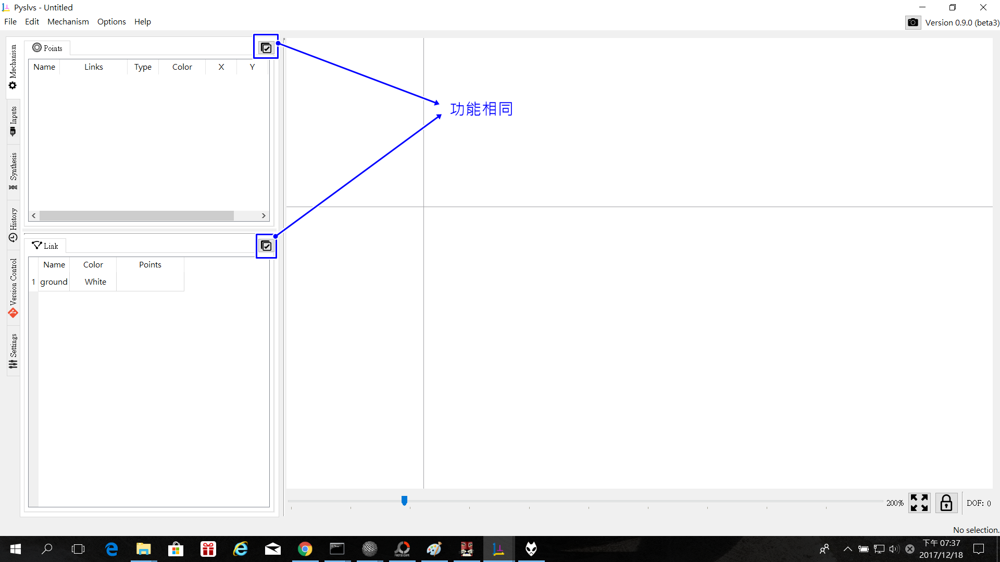
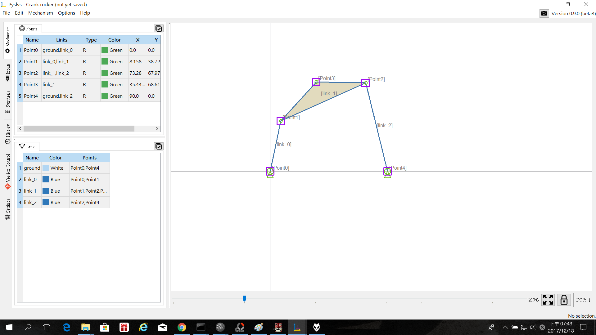

Title: 2017CD第八週
Date: 2017-03-01 11:00
Category: Course
Tags: brython, w8
Slug: 2017springCD-Week8
Author: 40423248

###簡介及介面介紹3:

####此版本為更新版Pyslvs 0.9-beta.3,新增了一些功能

####1.檔案區:新增了兩個範例Ball Lifter(Double six bar linkage), Crank Slider

####2.機構區:新增了Batch moving功能,按下時可對畫布上的點做任意移動

####3.左側方機構部分:開放點的滑塊功能和滑槽功能,介面中有部分修改,如下圖:

####(1)打勾的小圖示按一下可選取所有點或連桿,如下圖:

####(2)新增了點的滑槽和銷配合的功能,模擬滑塊作往復運動,運動如下:
<iframe src="https://player.vimeo.com/video/247790585" width="640" height="343" frameborder="0" webkitallowfullscreen mozallowfullscreen allowfullscreen></iframe>

<a href="https://vimeo.com/247790585">Pyslvs 0.9-beta.3 test1 Pin and Pin in slot</a> from <a href="https://vimeo.com/user46447136">40423248</a> on <a href="https://vimeo.com">Vimeo</a>.

####配合時先定好驅動的部位,再來是定好要當作滑槽的點,該點要先設定為固定,接著再設定該點的狀態為Pin in slot(滑槽),之後是設定滑銷的點,該點要先定在滑槽外,並與活動桿的一端跟滑槽連接在一起,再調整滑銷的點位置,該位置要與滑槽充重疊,這樣才可以到Input(輸入)做模擬運動,如下:
<iframe src="https://player.vimeo.com/video/247793534" width="640" height="343" frameborder="0" webkitallowfullscreen mozallowfullscreen allowfullscreen></iframe>

<a href="https://vimeo.com/247793534">Pyslvs 0.9-beta.3 test2 Pin and Pin in slot</a> from <a href="https://vimeo.com/user46447136">40423248</a> on <a href="https://vimeo.com">Vimeo</a>.

####4.左側方輸入部分:新增了Extreme rebound(極限回彈)的功能,當機構在運動時如遇到死點,此功能可以讓運動件回彈,可以做搖擺運動,如下:
<iframe src="https://player.vimeo.com/video/247795004" width="640" height="343" frameborder="0" webkitallowfullscreen mozallowfullscreen allowfullscreen></iframe>

<a href="https://vimeo.com/247795004">Pyslvs 0.9-beta.3 test3 Extreme rebound</a> from <a href="https://vimeo.com/user46447136">40423248</a> on <a href="https://vimeo.com">Vimeo</a>.

####(1)路徑區:

